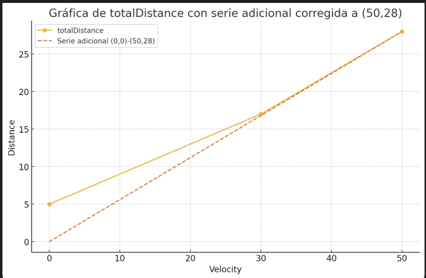

Un cruce simple, con vehículos que lo quieren atravesar perperndicularmente. En una única dirección.
En un porcentaje dado.
Se desea asociar la fase con relación al porcentaje.

Objetivos:

- Lenguaje de descripción de cruces, fuentes.
- Aritmética de eventos, como los AER (Adress event representation) de los spikes
- Que el reparto se ajuste a la densidad de vehículos

Desarrollo:
- Pseudogradiente en una PINN 100% física.

Debería modelar la llegada de vehículos en el cruce, considerando una distribución de Poisson para representar la aleatoriedad en los intervalos de tiempo entre llegadas. Esto permitirá simular escenarios realistas y ajustar dinámicamente las fases del semáforo según la densidad de tráfico.

Léxico en inglés:

Cruce: intersection
Movimiento: movement
Fase: phase
Semáforo: traffic light
Vehículo: vehicle   
Carretera: road
Punto de entrada: entry point
Punto de salida: exit point

Cada apertura tiene un tiempo.
Si no se puede ejecutar la salida se espera. y bloquea parte de la intersección.
Es mejor representar por metros. Velocidad y longitud del vehículo, con su distancia de parada y seguridad en marcha.

Los lanes? son una multiplicación de la capacidad. De momento en esta primera versión no se van a considerar.

Hay una negociación. Lo que te gustaría verter y lo que al final te permito verter.

Realmente el sistena se puede modelar como la distancia de vehículos en movimiento (con distancia de seguridad) Pero con un aunmente de la capacidad con la distancia en parada. 

La distancia se mide en metros.
La velocidad en km/h.
No usamos las unidades del SI. Sino las habituales en tráfico.

Si lo dibujo me aseguro la coherencia de manera visual.

Pixel por metro. Las medidas están en los Input y Output.

Hay un problema con el generador de poisson al tener en cuenta las medias físicas de los vehículos en movimiento. Si se solapan hay que desplazar el vehículo.

Por eficiencia se puede dar la lista de vehículos con sus distancias. El cruce, por ejemplo, sabiendo su tiempo, puede calcular cuantos entran en el cruce. Cuando se pone la luz verde y si está despejado.

El generador poisson podría tener un generador, tipo yield. Es muy cómodo como consumidor, y he de comunicar si puede o no puede entrar y hasta que momento he consumido.
Es como un analizador léxico, tengo caracteres en tentativa y consumo real. Lo lógico es que sea la propia carretera la que se ocupe de la responsabilidad de pretención, consumo. 

En vez del generador de poisson.
Teniendo en cuenta la capacidad de la intercepción.
Con la medida de los vehículos.
Podemos decidir por donde entran los próximos coches.
Según una probabilidad.

Generas un coche cada X tiempo y lo introduces al azar en una de las calles.

Tamaño medio de un coche en europa:
Según estudios recientes, el tamaño medio de un coche en Europa tiene aproximadamente:

- Longitud: 4.3 metros
- Anchura: 1.8 metros
- Altura: 1.5 metros

La distancia de seguridad recomendada entre vehículos en movimiento es de aproximadamente:
- 2 segundos de separación temporal (que a diferentes velocidades representa diferentes distancias)
- A 50 km/h: aproximadamente 28 metros
- A 30 km/h: aproximadamente 17 metros

En situación de parada (semáforo en rojo):
- Distancia entre vehículos: 1-2 metros
- Capacidad: aproximadamente 140-180 vehículos por kilómetro por carril

Hay dos puntos de vista, el cruce pide vehículos. 
O el vehículo intenta entrar.
Con la aritmética modular sería posible.
Pero ya no habría adaptación.

Vamos a pedir a la carretera que me de su previsión.

Quiero un generador de vehículos. Que meta según la proporción los vehículos por road 1 o road 2.
El vehículo se mete con push.

Hay tres eventos.
Dame vehículos hasta X tiempo.


Un semaforo se caracteriza por su:
ciclo, reparto y desfase.
En inglés:
cycle,split and offset.

Tengo dudas con la estructura de bifurcación.
Si se conecta directamente la carretera.

¿Qué ocurre cuando el tráfico se bifurca?
Es una intersección. 

Dentro puede tener una road...
En un futuro en las conexiones podremos poner bifurcaciones.

Cuando pasa de 50 km/h a 30 km/h se van añadiendo retrasos.
Para ello debo saber cuando la carretera se queda vacia para meter otra.
Y el get debe de esperar. Es por lo tanto el máximo entre el get y el quedarse libre.

Es raro porque al hacer un push, me indica cuando puede hacerse el próximo push.
Con eso basta. 
No saco aunque lleguen antes.
Hay un free input, y un free output.

Las carreteras son inelásticas.
Es decir tienen una capacidad ilimitada.

El freeInputTime se calcula con el de entrada del vehículo.

Hay que pensar en la interfaz gráfica.
El vehículo puede registrar las entradas y luego representar graficamente el movimiento.

El sensor está en el semáforo.
Debe cuadrar con el flujo.

Un objetivo era hacer el sistema autodiferncial. 

¿Cómo hace el sistema operativo?
Hay que insertar un coche. Pero cuando se llena sin salir ya no puede admitir mas entradas.
¿Cómo se simula la saturación?
¿por no mantener la distancia de seguridad?
Cuando no hay suficiente distancia de seguridad el tiempo de llegar a la salida aumenta. 

Pero aun me queda pensar en el orquestador.
Meto un coche y me dice cuando tengo que ejecutar el cruce.
La lógica es hacer el bash según la elasticidad posible.
Si en el otro extremo me hacen parár meterá retardo por saturación.

Cuando se ejecuta un semaforo no se sabe que la otra carretera no abierta se está saturando.
Hay que informarla de que no se está producciendo la entrada.

Se conduce a velocidad normal hasta llegar a la distancia de seguridad.

Las carreteras se ejecutan en paralelo hasta su capacidad con distancia de seguridad. 
A partir de ahí se ejecuta el extremo de salida.
Si se entapona, se puede ejecutar la entrada hasta el tiempo de entaponamiento.
Eso hará que la velocidad media disminuya.
Primero tienes que suprimir tiempos. Has de apretujar a los conductores.
Y llegado el caso has de impedir la entrada.

Podríamos ignorar el proceso de frenada. Haciendo que el nuevo lo asumiese todo. En teoría con una integral sería posible. O en base al frenazo y anteriores recalcular los tiempos de salida.

Sistema operativo:
La carretera cambia su posición de ejecucion con el cruce.

---

Podemos ejecutar un elemento hasta llegar a la capacidad de distancia de seguridad.
Y una vez alcanzado dicho punto hacemos un intercambio de punteros si la salida está por debajo.
Luego un problema secundario es la velocidad llegado a dicha saturación.

--- 

¿ Si la saturación responde o no a la distancia de seguridad se lo podemos preguntar.
El tiempo extra de compactación se puede ejecutar en lote, dado que es un incremento de llegada al extremo y solo se ejecuta cuando hay capacidad de admitir un nuevo coche. 
Me pregunto si hay fórmula empirica. 
Hasta que esto no se modele nunca tendremos el comportamiento de los detectores modelados.
Sobre todo el concepto de ocupación. 
En cualquier caso, sería interesante pensar en la media de ocupación y si esta solo depende del número de coches previos y a la velocidad de entrada atenuada, por el bloqueo.
Y el número de coches previos, en el momento de entrada o en el momento de entrada solamente.

---


La semilla de azar también sería deseable controlarla para la reproductibidad.

Pero si mañana hay un swapping necesito azar.

---

Tengo que modelar las salidas de las carreteras de salidas.
Simplemente ejecuto el 100% de la cola.

Al sacar al 100% no sé como es la densidad. 

Vamos a graficar la curva.

```python
    def totalDistance(self,velocity):
        if velocity == 0:
            return 1.5+self.length
        if velocity <= 30:
            return 17
        if velocity <= 50:
            return 28
```
Esta función transforma de velocidad a distancia.


Es casi una línea recta.

La densidad de coches da la distancia de seguridad.
La distancia de seguridad da la velocidad.

Pero la densidad de coches depende del scheduler.
Yo puedo saber cuando llegue a la punta cuantos coches habrán salido.
Se puede calcular una densidad de coches a toro pasado.

Se sabe a ciencia cierta cuando entra y cuando sale un coche.

Me da igual el scheduler. La media va a ser correcta.
Si se adelantan por el scheduler no va a afectar.

Si velocidad es cero, se ha bloqueado por saturación.
Ejecuta los elementos con saturación.

---

Al no admitir nuevas entradas eso explicaría la degeneración y los saltos de la envolvente que calculaba.

Sería curioso ver intensidad vs ocupación en los detectores.

Y verificar la salida de curvas características.

---

Si se usa el coche saliente para establecer la velocidad el problema es que el nuevo coche no va a superar dicho tiempo.
A menos que si podría haber salido cuente.


También podemos no poner el momento de llegada hasta sacar a un coche. 

Esto modelaría las velocidades ilegales. Sabríamos el tiempo que la sincronizacion semafórica te permite tener una velocidad por encima del límite establecido. 
¿ Preguntar si esto es deseable, si es un criterio de optimización a considerar también.


El problema es la velocidad mínima. Por densidad se puede deducir, pero no caigo ahora en la fórmula.



Se puede aplicar la unión con el extremo 0,0 y a partir de no asegurar la distancia mínima no se admite la entrada.
Una velocidad inferior a 10 Km/h hace que la carretera no admita nuevas entradas.

Tampoco se pueden admitir mas entradas si no se respeta la distancia mínima de seguridad. 

Se me ocurre que es posible un puntero circular. 
Y que dichos punteros pueden ser a vehículos. 
Ya que el tiempo es algo sobrevenido.
Incluso los coches tienen un anillo de momentos de entrada. 

Se puede empezar por implementar el llenado hasta capacidad.
Se llenaría hasta la capacidad máxima. Y luego al sacar el último vehículo sabemos el promedio de velocidad y por tanto la ocupación de los detectores.


No sería un simulador al uso ya que para ver la ejecución se debe haber simulado primero.

Orden de programación:
- Un ejecutor, FlowSync con elementos autoconscientes del orden que ocupan.
- Mecanismo que para de insertar y activa al output.
    - ¿Si son dos salidas cual?
    - Se para en llenado ¿a que velocidad?
- Simular varios cambios de ritmos.
- Curvas de detectores.
- Registrar en vehículos los momentos de cambios de roads.
- Usar en road solo punteros a vehículos, sin tiempos.
- Animar la simulación.

---

En el FlowSync, el sistema operativo, tengo dudas de cuando la entrada se pone el primero de la lista.

Empieza la entrada, satura una carretera y se intercambia.

Cuando termina de ejecutarse el cruce se puede intercambiar por la salida o por la entrada.

Si se ha saturado la salida esta.
Si no se ha saturado, cambia por la entrada.

Podemos simular un detector por road. 
Intuyes que la velocidad es deducible.

Una posibilidad mas sencilla es una ejecucion circular. 
Si se colorea un grafo, se podría ejecutar en paralelo por colores.

La intersección para cuando una carretera de salida se satura o cuando pides y está vacía.

---

La intersección termina:
- Cuando get no quedan mas. En este caso no sé como proceder. Tienes que parar el tiempo con el de la entrada del último elemento. Pero con el get no se sabe si es el último o quedan mas. A menos que devuelvas dos cosas.
- Cuando la road interna se llena. La vacía.
- Cuando la salida se satura.

Una de las cosas malas es que pasa uno cuando no debería.
Está lleno la cola.

El tiempo no debe cambiar.

---

El tiempo de la intercepción adelanta a un get que no se ha ejecutado para dicho momento.
¿Qué se debería hacer?
¿Cómo consolidamos la transferencia estandar para no tener errores?
¿Sacar factor común entre las dos transferencias de carretera?
¿Cómo evitas que la intercepción se quede colgada?

Supongamos que no podemos hacer un get sobre un elemento que no está actualizado.
Quiero poner un modo de parada.
Lo mismo que hicimos un error raise, en algo, en el get también.
Hay que diseñar una forma de que el generador actualice la fecha válida de una carretera.

Si se hace un push, sin vehículo se interpreta como que se puede ejecutar un get.

¿Al freeOutputTime le afecta el waiting?

Estoy haciendo coherente los tiempos.

El freeOutputTime es el tiempo que tarda en quedarse la calle libre en circustanciaas ideales.
Si hay un waiting, dicho tiempo aumenta.

Vamos a hacer una traza en el coche. No me creo que nos vayamos a 4300 segundos si solo hay hasta 3600.

----

Haz el sensor de una carretera a partir de los coches.

Se me quedan 10 coches sin salir.
Solucionado, al final cierro con null.

---

Creo que estoy metiendo mas coches de la capacidad.
La razón es que los saco. Y al vaciar los del futuro como el control es por longitud se satura por encima de su ocupación.
Lo ideal es controlar la ocupación en la entrada y cuando sea próximo a ...
Pero si introduzco un coche cada 2 segundos que throuput da la intersección.

Imagina que los coches entran a 10km/h, y calcula la ocupación.

147 coches deberían pasar y van desde 119.
Aunque los coches son ...
Porque el coche no entra hasta que no se abandona por completo.
Entonces el sistema se satura.

El problema está en el cruce. No entra el siguiente tras el otro, se espera a que abandone el cruce, luego la capacidad de transporte es menor que una entrada cada 2 segundos.

¿Confirmar el cruce, que no tiene la capacidad de 30Km/h porque se tiene que despejar, para que entre el siguiente.


---
- experimento senoidal.
- Te quedas el top 33 y 5.

147 coches en linea.

58*2=116

90 ciclo
112
105

112 ciclo
116
106

------

[] Mejor control de ocupación en el carril, saturación.
Al sacar uno, le calcula la velocidad media y por tanto la distancia de seguridad.
Mínimo 10 km/h

freeOutputTime es el que modera la entrada.
El problema es que queueLength incluye la longitud de vehículo.
Me interesa la distancia de separación y eso supone un cambio total del programa.


